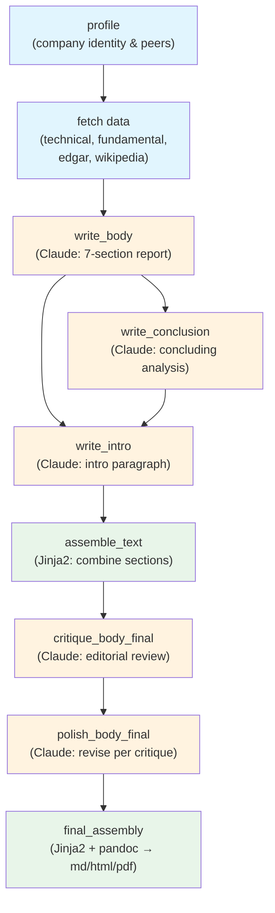

# Stock Research Agent

An async Python-orchestrated equity research pipeline that generates comprehensive analyst-style reports. A single script drives a DAG of data-gathering tasks and Claude writing agents, producing a polished report from one command.

## How It Works

```bash
./research.py AMD --date 20260225
```

This triggers a 14-task pipeline:



**Phase 1 — Data gathering** (parallel, blue): Profile fetches company identity, then data tasks run concurrently — technicals, fundamentals, SEC filings, Wikipedia.

**Phase 2 — Writing** (sequential, orange): Claude subagents synthesize all gathered data into a 7-section report body, then conclusion and intro are written. An editor agent critiques and a revision agent polishes.

**Phase 3 — Assembly** (green): Sections are concatenated via Jinja2, then the final report is assembled with charts and tables and converted to markdown, HTML, and PDF via pandoc.

## Architecture

**Orchestrator:** `research.py` — a single async Python script that reads the DAG, initializes the database, and runs waves of tasks as parallel subprocesses. Python data-gathering tasks run via `uv run python`, Claude writing tasks run via `claude --dangerously-skip-permissions -p`. All database writes are centralized in the orchestrator.

**State management**: One SQLite database per run (`work/{SYMBOL}_{DATE}/research.db`) tracks task status, dependencies, artifacts, and runtime variables. All components access state through `skills/db.py` — no direct SQL elsewhere.

**Artifact context**: A `manifest.json` file is maintained before each wave, listing all produced artifacts. Claude tasks read this file to discover available research data.

**DAG definition**: `dags/sra.yaml` declares tasks, types, dependencies, configs, and expected outputs in a version-2 schema validated by Pydantic.

## Data Sources

| Source | What it provides |
|--------|-----------------|
| **yfinance** | Price history, fundamentals, analyst recommendations |
| **TA-Lib** | Technical indicators (SMA, RSI, MACD, ATR, Bollinger Bands) |
| **OpenBB / FMP** | Financial statements, key ratios, peer comparisons |
| **Finnhub** | Peer company detection |
| **SEC EDGAR** | 10-K, 10-Q, 8-K filings via edgartools |
| **Wikipedia** | Company history and background |
| **Claude subagents** | Report writing, critique, and revision |

## Output

Each run produces `work/{SYMBOL}_{DATE}/artifacts/` containing 40+ files:

- `final_report.md` — the complete formatted report
- `chart.png` — stock price chart with technical overlays
- `profile.json`, `technical_analysis.json` — structured data
- `income_statement.csv`, `balance_sheet.csv`, `cash_flow.csv`, `key_ratios.csv` — financials
- `draft_report_body.md`, `draft_report_conclusion.md`, `draft_intro.md` — draft sections
- `report_body.md`, `report_critique.md`, `report_body_final.md` — critique/revise cycle
- SEC filing extracts, Wikipedia summaries

## Setup

### Prerequisites

- Python 3.10+
- [uv](https://docs.astral.sh/uv/) package manager
- [Claude Code](https://docs.anthropic.com/en/docs/claude-code) CLI
- System libraries: `pandoc`, `ta-lib`

### Install

```bash
# Install system dependencies (macOS)
brew install pandoc ta-lib
export TA_INCLUDE_PATH="$(brew --prefix ta-lib)/include"
export TA_LIBRARY_PATH="$(brew --prefix ta-lib)/lib"

# Install Python dependencies
uv sync
```

### Environment

Create a `.env` file in the project root:

```
SEC_FIRM=...
SEC_USER=...
OPENAI_API_KEY=...       # for embeddings
OPENBB_PAT=...
FMP_API_KEY=...
FINNHUB_API_KEY=...
```

## Usage

### Full pipeline

```bash
./research.py SYMBOL [--dag dags/sra.yaml] [--date YYYYMMDD]
```

The orchestrator validates the DAG, initializes the database, then executes waves of tasks in dependency order with parallel dispatch. Auto-skips failures and continues.

### Individual data scripts

Each data-gathering script runs standalone:

```bash
uv run ./skills/fetch_profile/fetch_profile.py AMD --workdir work/AMD_20260225
uv run ./skills/fetch_technical/fetch_technical.py AMD --workdir work/AMD_20260225
uv run ./skills/fetch_fundamental/fetch_fundamental.py AMD --workdir work/AMD_20260225
uv run ./skills/fetch_edgar/fetch_edgar.py AMD --workdir work/AMD_20260225
uv run ./skills/fetch_wikipedia/fetch_wikipedia.py AMD --workdir work/AMD_20260225
```

### Database CLI

```bash
uv run ./skills/db.py init --workdir work/AMD_20260225 --dag dags/sra.yaml --ticker AMD
uv run ./skills/db.py task-ready --workdir work/AMD_20260225
uv run ./skills/db.py status --workdir work/AMD_20260225
```

### Template rendering

```bash
# Generic template renderer
./skills/render_template.py \
  --template templates/assemble_report.md.j2 \
  --output work/AMD_20260225/artifacts/report_body.md \
  --json work/AMD_20260225/artifacts/profile.json \
  --file intro=work/AMD_20260225/artifacts/draft_intro.md \
  --file body=work/AMD_20260225/artifacts/draft_report_body.md

# Final report assembly (loads all artifacts automatically)
./skills/render_final.py --workdir work/AMD_20260225
```

## Project Structure

```
├── dags/
│   └── sra.yaml                    # DAG definition (14 tasks, v2 schema)
├── skills/
│   ├── db.py                       # SQLite state management CLI
│   ├── schema.py                   # Pydantic DAG validation models
│   ├── config.py                   # Centralized constants
│   ├── utils.py                    # Shared utilities
│   ├── render_template.py          # Generic Jinja2 renderer
│   ├── render_final.py             # Final report assembly
│   ├── fetch_profile/              # Company profile + peers
│   ├── fetch_technical/            # Chart + technical indicators
│   ├── fetch_fundamental/          # Financials, ratios, analyst data
│   ├── fetch_edgar/                # SEC filings
│   └── fetch_wikipedia/            # Wikipedia summary
├── templates/
│   ├── assemble_report.md.j2       # Section concatenation
│   └── final_report.md.j2          # Final formatted report
├── research.py                       # Async DAG orchestrator (entry point)
├── tests/
│   ├── test_db.py
│   └── test_schema.py
└── work/                           # Output (one dir per run)
    └── {SYMBOL}_{DATE}/
        ├── research.db
        └── artifacts/
```

## Script Conventions

All Python scripts follow a consistent pattern:

- `#!/usr/bin/env python3` shebang
- Import constants from `config.py`, utilities from `utils.py`
- `pathlib.Path` for all path operations
- `logger = setup_logging(__name__)` for output (stderr only)
- JSON manifest to stdout: `{"status": "complete", "artifacts": [...], "error": null}`
- Exit codes: 0 = success, 1 = partial, 2 = failure
- Type hints on all functions, specific exception handling
