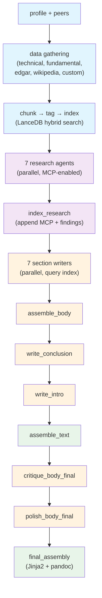

# Stock Research Agent

One command, full analyst-style equity research report.

```bash
./research.py NVDA
# → work/NVDA_20260317/artifacts/final_report.md
```

A steerable research and report-writing pipeline powered by Claude Code. Define an outline as a DAG, point it at data sources, and get a structured report — currently configured for equity research, but the engine is generic.

## Example Report

[NVDA — March 16, 2026](https://github.com/druce/deep-research-machine/raw/master/AMZN.pdf)

## How It Works

The pipeline runs ~33 tasks in dependency order: gather data, index it, research it, write sections, assemble a report.

1. **Gather data** — Python scripts fetch company profile, financials, SEC filings, technical indicators, Wikipedia, and custom research questions
2. **Chunk & index** — text artifacts are split into chunks, embedded, and stored in a LanceDB hybrid (vector + BM25) index, tagged by report section
3. **Research** — 7 agents run in parallel, each querying the index and using MCP tools to dig deeper. Findings flow back into the index so researchers can build on each other's work
4. **Write** — 7 section writers run in parallel, each querying the unified index. Each goes through a critic-rewrite loop
5. **Assemble** — sections are concatenated, conclusion and intro written, a final critique-polish pass applied, and the report rendered to markdown/HTML/PDF



Colors: blue = data gathering & indexing, purple = research, orange = writing & editing, green = final assembly.

## What Makes It Different

**DAG + Claude Code hybrid.** The orchestrator (`research.py`) runs a dependency graph where each node is either a Python script or a `claude -p` subprocess with full tool access. This combines the reliability of a state machine (retries, resume, parallel dispatch) with the flexibility of autonomous Claude agents (web search, code execution, MCP tools).

**Steerable.** The report outline, research questions, writing prompts, style guide, and data sources are all configuration — not code. Change what gets researched and how it's written without touching the pipeline.

**Extensible.** Add data sources by writing a Python script or adding MCP tools. Add report sections by editing the DAG. The pipeline doesn't know or care what "equity research" means — it just runs tasks in order.

## Customization

| What | Where | How |
|------|-------|-----|
| **Research questions** | `custom_prompts.json` in workdir | At the start of the worklow, add specific investigation questions/prompts |
| **Report sections** | `dags/sra.yaml` | Add, remove, or reorder sections; adjust dependencies |
| **Writing prompts** | `dags/sra.yaml` task configs | Edit the system/user prompts for each writer and critic |
| **Style guide** | `STYLE.md` | Set tone, source hierarchy, formatting rules |
| **Critic iterations** | `dags/sra.yaml` `n_iterations` | Control how many critic-rewrite passes each section gets |
| **Data sources** | `.env` + MCP config + Python scripts | Add API keys, MCP servers, or write new fetch scripts |
| **Report templates** | `templates/*.md.j2` | Modify Jinja2 templates for final assembly |

## Quick Start

### Prerequisites

- Python 3.10+
- [uv](https://docs.astral.sh/uv/) package manager
- [Claude Code](https://docs.anthropic.com/en/docs/claude-code) CLI
- System libraries: `pandoc`, `ta-lib`

### Install

```bash
# System dependencies (macOS)
brew install pandoc ta-lib
export TA_INCLUDE_PATH="$(brew --prefix ta-lib)/include"
export TA_LIBRARY_PATH="$(brew --prefix ta-lib)/lib"

# Python dependencies
uv sync
```

### Environment

Create a `.env` file in the project root:

```
SEC_FIRM=...              # SEC EDGAR identity (firm name)
SEC_USER=...              # SEC EDGAR identity (email)
OPENAI_API_KEY=...        # Chunk embeddings (text-embedding-3-small)
OPENBB_PAT=...            # OpenBB Platform access token
FMP_API_KEY=...           # Financial Modeling Prep API key
FINNHUB_API_KEY=...       # Finnhub API key (peer detection)
BRAVE_API_KEY=...         # Brave Search (MCP research agents)
ALPHAVANTAGE_API_KEY=...  # Alpha Vantage (MCP research agents)
PERPLEXITY_API_KEY=...    # Perplexity AI (optional, MCP research)
```

No `ANTHROPIC_API_KEY` needed — all Claude tasks run via the Claude Code CLI subprocess.

### Run

```bash
./research.py NVDA
```

## Usage

### Full pipeline

```bash
./research.py SYMBOL [--dag dags/sra.yaml] [--date YYYYMMDD] [--clean]
```

### Resume a failed run

```bash
./research.py SYMBOL --resume [--retry-failed]
```

`--resume` picks up where a previous run left off — tasks stuck in `running` are reset to `pending`, completed tasks are skipped. Add `--retry-failed` to also retry tasks that previously failed.

### Run a single task

```bash
./research.py SYMBOL --task TASK_ID
```

Runs one task by ID (workdir must already exist). Useful for re-running a specific step after fixing an issue.

### Web UI

```bash
uvicorn web:app --reload
```

FastAPI interface at `http://localhost:8000` with live log streaming via WebSocket.

## Data Sources

| Source | What it provides |
|--------|-----------------|
| **yfinance** | Price history, fundamentals, analyst recommendations |
| **TA-Lib** | Technical indicators (SMA, RSI, MACD, ATR, Bollinger Bands) |
| **OpenBB / FMP** | Financial statements, key ratios, peer comparisons |
| **Finnhub** | Peer company detection |
| **SEC EDGAR** | 10-K, 10-Q, 8-K filings via edgartools |
| **Wikipedia** | Company history and background |
| **Brave / Perplexity** | Web search for research agents (via MCP) |
| **Claude subagents** | Report writing, critique, and revision |

## Output

Each run produces `work/{SYMBOL}_{DATE}/artifacts/` containing 40+ files:

- `final_report.md` — the complete formatted report
- `chart.png` — stock price chart with technical overlays
- `profile.json`, `technical_analysis.json` — structured data
- `income_statement.csv`, `balance_sheet.csv`, `cash_flow.csv`, `key_ratios.csv` — financials
- Section drafts, critic feedback, and revision history in `drafts/`

## Project Structure

```
├── research.py                     # Async DAG orchestrator (entry point)
├── web.py                          # FastAPI web runner + WebSocket logs
├── dags/
│   └── sra.yaml                    # DAG definition (33 tasks, v2 schema)
├── skills/
│   ├── db.py                       # SQLite state management CLI
│   ├── schema.py                   # Pydantic DAG validation models
│   ├── config.py                   # Centralized constants
│   ├── fetch_profile/              # Company profile + peers
│   ├── fetch_technical/            # Chart + technical indicators
│   ├── fetch_fundamental/          # Financials, ratios, analyst data
│   ├── fetch_edgar/                # SEC filings
│   ├── fetch_wikipedia/            # Wikipedia summary
│   ├── custom_research/            # User-provided investigation prompts
│   ├── chunk_index/                # Chunk, tag, build LanceDB index
│   ├── search_index/               # Hybrid vector + BM25 search
│   └── mcp_proxy/                  # MCP caching proxy
├── templates/                      # Jinja2 report assembly templates
├── tests/                          # pytest suite (210+ tests)
└── work/                           # Output (one dir per run)
    └── {SYMBOL}_{DATE}/
        ├── research.db             # Task state
        ├── artifacts/              # Final outputs
        └── drafts/                 # Iteration history
```
